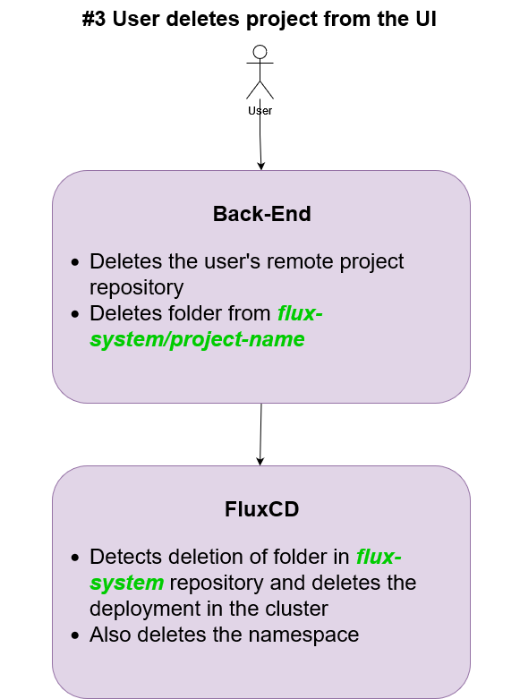

# Technical Details

## Architecture

## Components

* Code Reloader (`code-reloader` repository)
  * Docker image that just runs `git diff` on the mounted Persistent Volume (PV) and pulls the latest changes into the mounted PV if there are any changes
  * It is run as a `init-container` as part of the deployed project pod. It will run before the user project pod, updates the PV, then exits, before the project pod initializes and mounts the same PV.
* Image Builder (`image-builder` repository)
  * Gitlab-CI pipeline that builds a new image when dependencies change and push to harbor repository
* Gitlab Webhook Receiver (`gitlab-webhook-receiver` repository)
  * Since we are not including a `.gitlab-ci.yml` file in the user's project repository, we need a way to detect when the user push code to the repository on gitlab, this API server acts as the bridge to call other gitlab pipelines that should run when the user push code to his/her repository
  * API server written in `Go` with `/build-image` and `/code-reload` endpoints are set as webhooks to every user project repository
    * `/build-image`: Triggers `Gitlab-CI` pipeline in `image-builder` repository to check for changes in dependency, and if so, to build and push the new image into harbor repository
    * `/code-reload`: Triggers `Gitlab-CI` pipeline `restart` branch of `code-reloader` repository that deletes the user's project pod such that it will restart again and the `code-reloader` component will initialize again
      * This is a workaround as FluxCD does not allow us to monitor take actions on a repository it is not already monitoring. This may change as we try to find a workaround that does not involve using Gitlab-CI as a CD tool
* FluxCD (`flux-system` repository)
  * Continuous Deployment (CD) tool that monitors changes to git repositories and docker image repositories like harbor and automatically updates deployments with the newest versioned image
  * User's built images are tagged by timestamp and FluxCD takes the newest image to update the deployments
  * Use FluxCD instead of Gitlab CI for Continuous Deployment is to limit access to the cluster, FluxCD is deployed within the cluster whereas you need to give Gitlab access to the cluster to deploy into
* Nakama API Backend (`backend` repository)
* Nakama UI Frontend (`frontend` repository)
* App-Starter-Kit (`app-starter-kit` repository)
  * Streamlit template files for user to create a new streamlit project

## Usage Flow

### 1. User creates a project from the User Interface

### 2. User push code changes to the remote git repository

### 3. User deletes the project from the User Interface

## Notes

* User will be added into gitlab repository as a maintainer, and thus do not have the access to delete the repository directly from Gitlab and would have to delete the project from the UI instead
